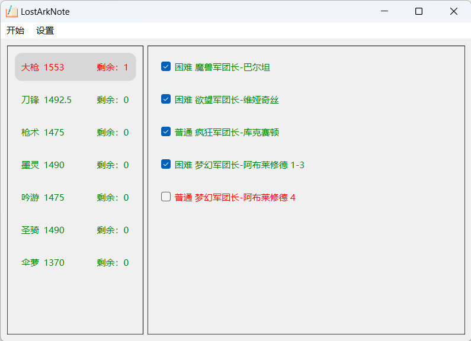

# LostArkNote/命运方舟副本笔记本

为了多角色肝帝记录还有那些副本没打写的QAQ，可从Release下载已经打包好的exe版本

程序生成的临时文件在C:\Users\\$USER\AppData\Local\LostArkNote下，用ini文件保存，其中可以修改配置文件目录地址。

所有角色的装分，昵称等名字需要自己手动输入。没找到腾讯获取角色信息的api，以后研究把

放一张主界面的图，绿色表示全部打完，红色表示还没打。

